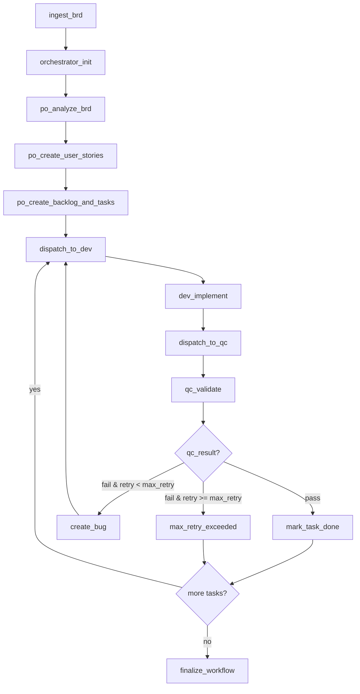

# Multi-Agent Workflow with LangGraph + FastAPI + React

Hệ thống demo một workflow multi-agent gồm **Orchestrator**, **PO**, **DEV**, **QC** với:
- **LangGraph** cho stateful workflow, conditional routing, retry loop
- **FastAPI** cho REST API
- **Postgres** cho persistence
- **React** cho control panel
- **Polling** để mô phỏng near real-time status update

## 1) Kiến trúc ngắn gọn

- **Orchestrator Layer**: khởi tạo workflow từ BRD, điều phối node LangGraph, lưu audit log, cập nhật trạng thái và expose dữ liệu cho UI.
- **Agent Layer**: PO / DEV / QC được mock thành các class riêng để sau này thay bằng LLM thật.
- **Persistence Layer**: SQLAlchemy + Postgres lưu BRD, workflow execution, tasks, bug reports, agent runs, state transitions, event logs.
- **Control UI**: React gọi REST API theo polling để hiển thị danh sách workflow/task, trạng thái, agent hiện tại, timeline, retry count, step flow.

## 2) Mermaid flow



## 3) Cấu trúc thư mục

```text
multi_agent_langgraph_system/
├── app/
│   ├── agents/
│   ├── api/
│   │   └── routes/
│   ├── core/
│   ├── db/
│   ├── graph/
│   ├── models/
│   ├── repositories/
│   ├── sample_data/
│   ├── schemas/
│   ├── services/
│   ├── tests/
│   └── main.py
├── frontend/
│   └── src/
├── scripts/
├── docker-compose.yml
├── requirements.txt
└── README.md
```

## 4) Chạy local

### Backend

```bash
cp .env.example .env
python -m venv .venv
source .venv/bin/activate
pip install -r requirements.txt

docker compose up -d postgres
python scripts/init_db.py
python scripts/seed_demo.py
uvicorn app.main:app --reload --port 8001
```

API docs: `http://localhost:8001/docs`

### Frontend

```bash
cd frontend
npm install
npm run dev
```

UI: `http://localhost:5173`

## 5) Demo end-to-end

1. Seed script tạo 1 BRD demo và 1 workflow execution.
2. Từ UI hoặc API gọi endpoint `POST /api/v1/workflows/{workflow_id}/run`.
3. UI polling các endpoint workflow/task/events để hiển thị timeline gần thời gian thực.

## 6) Chạy test

```bash
pytest app/tests -q
```

## 7) Thay mock bằng LLM thật

Các điểm thay thế:
- `app/agents/po_agent.py`
- `app/agents/dev_agent.py`
- `app/agents/qc_agent.py`

Giữ nguyên contract input/output của các agent service.
Workflow core ở `app/graph/` không cần đổi nhiều.

### Gợi ý tích hợp
- PO Agent: gọi LLM để trích user story / acceptance criteria / backlog
- DEV Agent: gọi code generation model, repo-aware toolchain, unit-test synthesis
- QC Agent: gọi evaluator model hoặc rule-engine + test runner

## 8) Ghi chú thiết kế

- LangGraph Graph API phù hợp cho workflow có state tường minh, node/edge rõ ràng và conditional routing. Tài liệu chính thức mô tả node là function, edge quyết định bước tiếp theo, và graph được compile trước khi chạy. citeturn885037search0turn885037search16
- FastAPI phù hợp cho backend nhiều module và dependency injection rõ ràng; tài liệu chính thức cũng khuyến nghị tách app thành nhiều file khi ứng dụng lớn hơn. citeturn885037search13turn885037search15turn885037search11
